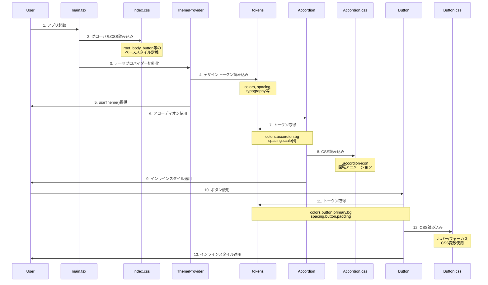

# CSS Architecture

このプロジェクトのCSS/スタイリング構造を説明します。

## スタイル適用の流れ（シーケンス図）



## ディレクトリ構造

```
main.tsx
  ↓
  ├─ index.css (グローバルベーススタイル)
  │   └─ :root, body, button, summary, a, h1
  │
  ├─ ThemeProvider
  │   └─ デザイントークン (TypeScript)
  │       ├─ colors.ts
  │       ├─ spacing.ts
  │       ├─ typography.ts
  │       ├─ radii.ts
  │       ├─ shadows.ts
  │       ├─ borders.ts
  │       ├─ transitions.ts
  │       └─ accessibility-levels.ts
  │
  └─ コンポーネント
      ├─ Accordion.tsx
      │   ├─ tokens経由でスタイル取得
      │   ├─ Accordion.css (.accordion-icon回転アニメーション)
      │   └─ インラインスタイル適用
      │
      └─ Button.tsx
          ├─ tokens経由でスタイル取得
          ├─ Button.css (ホバー/フォーカススタイル)
          └─ インラインスタイル適用
```

## 1. グローバルスタイル (index.css)

**場所**: `src/index.css`

**役割**: アプリケーション全体の基礎スタイル

**内容**:
- `:root`: フォント、line-height、font-smoothing
- ダークモード: `[data-theme="dark"]`
- フォームコントロール: `input[type="checkbox"]`, `input[type="radio"]`
- ベース要素: `a`, `body`, `h1`
- アコーディオン: `summary` マーカー非表示

**読み込み順序**: 最初（main.tsxで最初にインポート）

## 2. デザイントークン (TypeScript)

**場所**: `src/design-system/tokens/`

**役割**: スタイル値を一元管理

**トークン一覧**:

### 2.1 Colors (`colors.ts`)
```typescript
colors.primitive.{color}.{shade}  // 基礎色
colors.contents.{variant}              // テキスト色
colors.background.{variant}        // 背景色
colors.border.{variant}            // ボーダー色
colors.button.{variant}.{state}    // ボタン専用色
colors.input.{variant}             // 入力欄専用色
colors.accordion.{variant}         // アコーディオン専用色
```

### 2.2 Spacing (`spacing.ts`)
```typescript
spacing.scale[0-64]              // 基本スケール
spacing.semantic.{size}          // セマンティック (xs, sm, md, lg, xl)
spacing.button.{padding/gap}     // ボタン専用
spacing.input.{padding/gap}      // 入力欄専用
```

### 2.3 Typography (`typography.ts`)
```typescript
typography.fontFamily.{base|mono|serif}
typography.fontSize.{xs|sm|base|lg|xl|2xl|3xl|4xl|5xl|6xl}
typography.fontWeight.{light|normal|medium|semibold|bold}
typography.lineHeight.{none|tight|snug|normal|relaxed|loose}
```

### 2.4 その他
- **Radii** (`radii.ts`): border-radius
- **Shadows** (`shadows.ts`): box-shadow
- **Borders** (`borders.ts`): border-width
- **Transitions** (`transitions.ts`): duration, easing
- **Accessibility Levels** (`accessibility-levels.ts`): WCAG A/AA/AAA

## 3. ThemeProvider

**場所**: `src/design-system/theme/ThemeProvider.tsx`

**役割**:
- ライト/ダークモード切り替え
- デザイントークンの提供
- `useTheme()` フックでコンポーネントからアクセス

**使用例**:
```tsx
const { colors, mode, toggleTheme } = useTheme();
```

## 4. コンポーネントCSS

### 4.1 Accordion.css

**場所**: `src/design-system/components/Accordion.css`

**内容**:
```css
/* アコーディオンの開閉アニメーション */
details[open] .accordion-icon {
  transform: rotate(180deg);
}

/* summary要素のデフォルトマーカーを非表示 */
summary::-webkit-details-marker { display: none; }
summary::marker { display: none; }
```

**理由**: CSSアニメーションはインラインスタイルで記述できないため

### 4.2 Button.css

**場所**: `src/design-system/components/Button.css`

**内容**:
```css
/* ホバー時のスタイル（CSS変数使用） */
.button-primary:hover:not(:disabled) {
  background-color: var(--hover-bg);
  border-color: var(--hover-border);
}

/* フォーカス時のスタイル（キーボード操作時のみ） */
.button-primary[data-focused] {
  background-color: var(--focus-bg);
  color: var(--focus-text);
  outline: var(--focus-outline-width) solid var(--focus-outline);
  outline-offset: var(--focus-outline-offset);
}
```

**CSS変数の設定**:
```tsx
// Button.tsx内で動的に設定
style={{
  '--hover-bg': colors.button.primary.bgHover,
  '--focus-bg': levelFocus.background,
  ...
}}
```

## 5. インラインスタイル

**使用場所**: 全コンポーネント

**理由**:
- デザイントークンから動的に値を取得
- WCAGレベルに応じた動的なスタイル変更
- テーマ切り替え対応

**例**:
```tsx
<button
  style={{
    backgroundColor: colors.button.primary.bg,
    padding: `${spacing.button.paddingY.md} ${spacing.button.paddingX.md}`,
    fontSize: typography.fontSize.base,
    borderRadius: radii.borderRadius.md,
  }}
>
```

## スタイル優先順位

1. **index.css** (最も低い優先度)
   - グローバルなデフォルトスタイル

2. **コンポーネントCSS** (Accordion.css, Button.css)
   - アニメーションやホバー/フォーカス
   - CSS変数を使用して動的な値を受け取る

3. **インラインスタイル** (最も高い優先度)
   - デザイントークンから生成
   - コンポーネント固有のスタイル

## デザイントークンの3層構造

```
Primitive Tokens (基礎値)
  ↓
Semantic Tokens (意味的な値)
  ↓
Component Tokens (コンポーネント専用値)
```

### 例: ボタンの背景色

```typescript
// 1. Primitive (基礎値)
primitive.blue[500] = '#2196f3'

// 2. Semantic (意味的な値)
colors.brand.primary = '#2196f3'

// 3. Component (コンポーネント専用)
colors.button.primary.bg = colors.brand.primary
```

## テーマ切り替え

**仕組み**:
1. `ThemeProvider`が`data-theme`属性を`<html>`に設定
2. `index.css`で`[data-theme="dark"]`セレクタを使用
3. コンポーネントは`useTheme()`で動的に色を取得

**例**:
```css
/* index.css */
:root[data-theme="light"] {
  color: #213547;
  background-color: #ffffff;
}

:root[data-theme="dark"] {
  color: #fafafa;
  background-color: #212121;
}
```

```tsx
// Component
const { colors } = useTheme();
// colors.contents.primary は自動的にテーマに応じた値を返す
```

## まとめ

- **グローバルスタイル**: index.cssで最小限
- **デザイントークン**: TypeScriptで一元管理
- **コンポーネントCSS**: アニメーションと疑似クラスのみ
- **インラインスタイル**: メインのスタイリング手法
- **テーマ対応**: ThemeProviderとuseTheme()で実現
